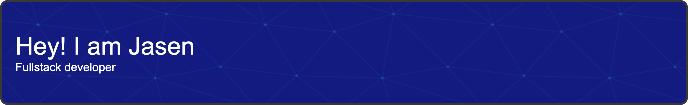

I am a fullstack application developer, interested in DevOps, self-hosting, and containerized apps/services. I have a B.S. Computer Science, graduated December 2020.

🔭 I’m currently working on:
- Bare-metal K8s
- Self-hosted websites 

🌱 I’m currently learning:
- Kubernetes
- Flutter

💬 Ask me about: 
- PostgreSQL
- Rails

📫 How to reach me: 
- (217) 721-7655 
- jasenlabolle@gmail.com

😄 Pronouns: 
- he/him/his

⚡ Fun fact(s): 
- I have a pet hedgehog named Penelope 🦔

Professional Experience with:
- Omnis Studio 10
- Ruby on Rails
- PostgreSQL
